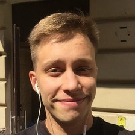

# Bochin Anton


---

## Contacts:
+ Discord: Zozo
+ E-mail: antonbocin342@gmail.com
+ Tel: +79213335496
+ Telegram: https://t.me/BochinAnton1

---

## About me:
I'm 25 years old, I'm a mathematics teacher. In my free time, I self-taught programming.
I like programming and want to connect my life with it. I can make a backend in python and would like to learn how to make a frontend.

---

## Code example:

```python
def string_formatter(string):
    words = string.split()
    words = words[1:-2]
    for e in words:
        e = e.strip(' ')
    return ' '.join(words)


data = input()
print(string_formatter(data))
```
---

## Skills:
+ Python3
+ Flask
+ PostgreSQL
+ Math
+ Git/GitHub(basics)
+ HTML(basics)
+ CSS(basics)

---

## Education and courses:
    1. Peter the Great St.Petersburg Polytechnic University(Information Security)
    2. https://www.freecodecamp.org/ HTML CSS Basics

---

## Languages:
    1. Russian(native language)
    2. English A2(pre intermediate)